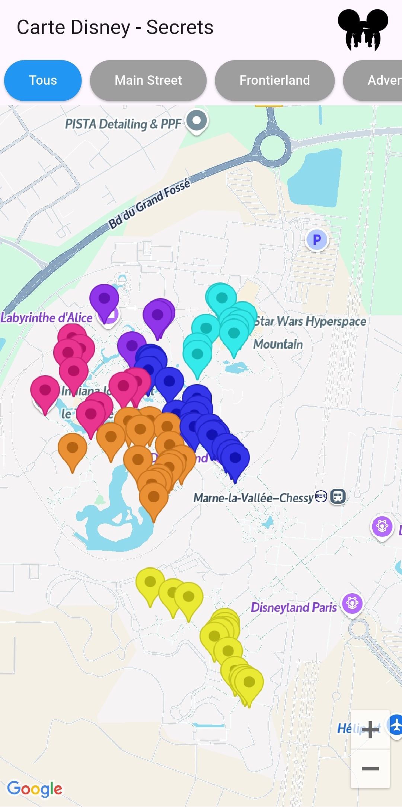
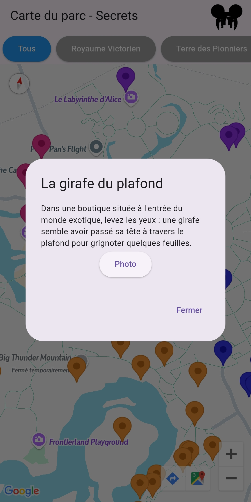
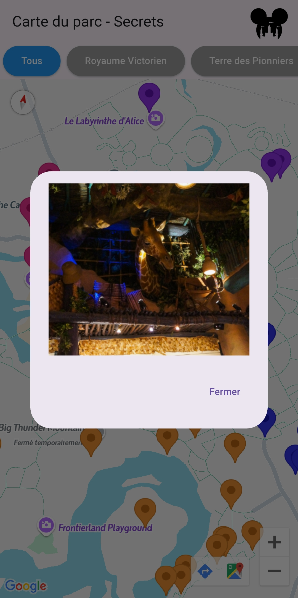

# Disney-Secret-App

**Carte Disney - Secrets** est une application interactive permettant de découvrir des lieux cachés et des points d’intérêt secrets à Disneyland Paris. Explorez les différents secrets du parc, filtrez les lieux par catégorie, et obtenez des informations détaillées sur chaque endroit.

## Fonctionnalités

-   Affichage de lieux secrets à Disneyland Paris sur une carte interactive.
-   Filtrage des lieux par différentes catégories (Main Street, Adventureland, Fantasyland, etc.).
-   Détails des points d’intérêt avec des informations supplémentaires lorsqu'on clique sur un marqueur.
-   Utilisation de l'API Google Maps pour l'affichage de la carte.

## Screenshot de l'application





## Détail des fonctionnalités

1. **Affichage de la carte** : La carte utilise l'API Google Maps pour afficher les points d'intérêt et les lieux secrets.
2. **Filtrage des lieux** : Vous pouvez filtrer les lieux secrets en fonction de la zone (Main Street, Adventureland, Fantasyland, Discoveryland, Studios).
3. **Informations détaillées sur les lieux** : En cliquant sur un marqueur, une fenêtre contextuelle s'ouvre pour afficher les détails du lieu secret.
4. **Personnalisation de l'apparence de la carte** : La carte utilise un style personnalisé pour afficher les lieux d’intérêt spécifiques à Disney.

## Prérequis

Avant de commencer l'installation, assurez-vous d'avoir les éléments suivants installés :

-   **Flutter** version 3.0 ou supérieure.
-   **Android Studio** ou tout autre IDE compatible avec Flutter.
-   **Google API Key** pour utiliser l'API Google Maps dans l'application.

## Installation

### 1. Cloner le projet

Clonez le projet en utilisant la commande suivante :

```bash
git clone https://github.com/D3vThomas/Disney-Secret-App.git
cd Disney-Secret-App
```

### 2. Installer les dépendances

Exécutez la commande suivante pour installer toutes les dépendances Flutter nécessaires :

```bash
flutter pub get
```

### 3. Configurer la clé API Google Maps

Pour que l'application fonctionne correctement, vous devez obtenir une clé API Google Maps.

#### Obtenir une clé API Google

1. Allez sur la [Google Cloud Console](https://console.cloud.google.com/).
2. Créez un projet ou sélectionnez un projet existant.
3. Allez dans **APIs & Services > Credentials**.
4. Créez une nouvelle clé API et copiez-la.

### 4. Ajouter la clé API dans le `AndroidManifest.xml`

Ouvrez le fichier `android/app/src/main/AndroidManifest.xml` et ajoutez la ligne suivante dans la balise `<application>` :

```xml
<application
    android:name="io.flutter.app.FlutterApplication"
    android:label="Disney-Secret-App"
    android:icon="@mipmap/ic_launcher">
    <meta-data
        android:name="com.google.android.maps.v2.API_KEY"
        android:value="VOTRE_CLÉ_API_GOOGLE" />
    ...
</application>
```

Remplacez `VOTRE_CLÉ_API_GOOGLE` par la clé API que vous avez générée précédemment.

## Lancer l'application

Pour lancer l'application sur un appareil ou un émulateur, utilisez la commande suivante :

```bash
flutter run
```

## Générer l'APK

Si vous souhaitez générer un APK pour distribuer l'application, utilisez la commande suivante :

```bash
flutter build apk --release
```

L'APK sera généré dans le répertoire `build/app/outputs/flutter-apk/`.

## Structure du projet

Voici la structure principale du projet :

```
Disney-Secret-App/
├── android/                # Code spécifique à Android
├── assets/                 # Ressources comme les images et les fichiers JSON
├── lib/                    # Code Dart de l'application
│   ├── main.dart           # Point d'entrée de l'application
├── test/                   # Tests unitaires et tests de l'application
├── pubspec.yaml            # Fichier de configuration de Flutter
├── android/app/src/main/AndroidManifest.xml   # Configuration Android
└── README.md               # Documentation du projet
```

## Contribuer

Si vous souhaitez contribuer à ce projet, voici quelques étapes simples à suivre :

1. Forkez le projet sur GitHub.
2. Créez une branche pour votre fonctionnalité ou correction de bug.
3. Faites vos modifications.
4. Testez les changements.
5. Soumettez une pull request avec une description détaillée.

Nous apprécions toutes les contributions et suggestions !

### Discussions

Si vous avez des questions, des suggestions ou des idées, vous pouvez démarrer une nouvelle discussion dans notre repository GitHub.  
Cliquez sur le lien ci-dessous pour commencer :

[Start a new discussion](https://github.com/D3vThomas/App-Disney-Secret/discussions/2)

## Licence

Ce projet est sous la licence **MIT**. Voir le fichier [LICENSE](LICENSE) pour plus de détails.
